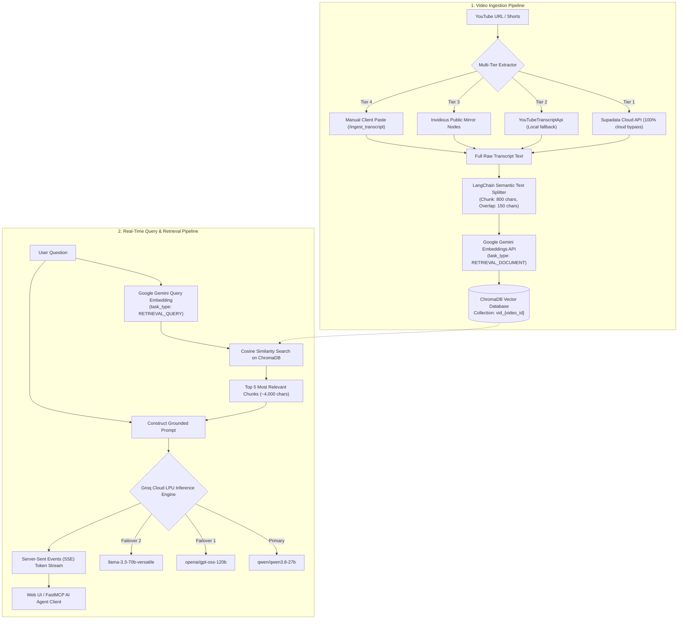

# 🎬 YT Helper — YouTube AI RAG Chatbot & API

> **Query, summarize, and extract actionable insights from any YouTube video in seconds — without watching hours of footage.**

<div align="center">

[](https://video-chatbot-ihi8.onrender.com/)
[](https://video-chatbot-ihi8.onrender.com/docs)
[](https://ytrag-seven.vercel.app/)
[](mcp_server.py)

<br/>


</div>

---

## 🌐 Live Deployed Links

| Service | Direct URL | Description |
| :--- | :--- | :--- |
| 🚀 **Live Backend API** | **[https://video-chatbot-ihi8.onrender.com/](https://video-chatbot-ihi8.onrender.com/)** | Primary FastAPI production service hosted on Render |
| 📖 **Interactive Swagger Docs** | **[https://video-chatbot-ihi8.onrender.com/docs](https://video-chatbot-ihi8.onrender.com/docs)** | Test every endpoint directly in your browser |
| 💓 **API Health Endpoint** | **[https://video-chatbot-ihi8.onrender.com/health](https://video-chatbot-ihi8.onrender.com/health)** | Uptime & auto-heartbeat status check |
| 🎨 **Live Web Frontend** | **[https://ytrag-seven.vercel.app/](https://ytrag-seven.vercel.app/)** | Glassmorphic dark-mode web application hosted on Vercel |

---

## 📑 Table of Contents

- [✨ What is YT Helper?](#-what-is-yt-helper)
- [🔄 Complete End-to-End Workflow](#-complete-end-to-end-workflow)
- [🛡️ 4-Tier Anti-Block Transcript Pipeline](#️-4-tier-anti-block-transcript-pipeline)
- [⚡ High-Speed Groq Inference & Token Economics](#-high-speed-groq-inference--token-economics)
- [🔌 Model Context Protocol (MCP) Server for AI IDEs](#-model-context-protocol-mcp-server-for-ai-ides)
- [📡 Complete API Endpoints Reference](#-complete-api-endpoints-reference)
- [💻 Frontend Features](#-frontend-features)
- [💓 Automated Free-Tier Keep-Alive](#-automated-free-tier-keep-alive)
- [🏗️ Project Architecture & Directory Structure](#️-project-architecture--directory-structure)
- [🛠️ Local Installation & Setup](#️-local-installation--setup)
- [☁️ Cloud Deployment Guide](#️-cloud-deployment-guide)
- [💰 Token & Cost Analysis](#-token--cost-analysis)
- [📄 License](#-license)

---

## ✨ What is YT Helper?

Watching a 2-hour lecture, podcast, or coding tutorial just to answer one specific question is inefficient. **YT Helper** solves this using **Retrieval-Augmented Generation (RAG)**:

1. You supply any YouTube video link (regular video, Shorts, or live recording).
2. YT Helper extracts the full transcript using a resilient **4-tier extraction pipeline** that bypasses YouTube IP bans.
3. The transcript is intelligently chunked and converted into high-dimensional vector embeddings via **Google Gemini**.
4. Chunks are stored in a persistent **ChromaDB** vector database.
5. When you ask a question, the system finds the most semantically relevant transcript sections and passes them to **Groq Cloud's ultra-fast LPUs** (`qwen/qwen3.8-27b`, `openai/gpt-oss-120b`, `llama-3.3-70b-versatile`).
6. The answer streams in real-time, grounded purely in the video's actual dialogue, with zero hallucinations and minimal token consumption.

---

## 🔄 Complete End-to-End Workflow

The diagram below outlines the entire lifecycle of a request from video ingestion to real-time response generation:



### Detailed Workflow Phases:

1. **URL Parsing & ID Extraction**: Validates URLs, formats (e.g., `youtu.be/`, `youtube.com/watch?v=`, `/shorts/`), and isolates the unique 11-character video ID.
2. **Transcript Retrieval**: Queries Supadata, local transcript libraries, or decentralized mirror instances to retrieve official or auto-generated subtitles.
3. **Semantic Text Chunking**: Splits large transcripts into overlapping 800-character segments with 150-character overlaps using `RecursiveCharacterTextSplitter`. This preserves semantic continuity across sentence boundaries.
4. **Vector Embedding**: Each chunk is embedded into dense vectors using Google GenAI models (`gemini-embedding-001` / `text-embedding-004`) optimized with `task_type="RETRIEVAL_DOCUMENT"`.
5. **ChromaDB Storage**: Vectors and metadata are stored in dedicated collections named `vid_{video_id}` for isolated per-video retrieval.
6. **Similarity Search**: When a user queries, their question is embedded with `task_type="RETRIEVAL_QUERY"`, and ChromaDB returns the top 5 closest semantic chunks.
7. **Fast Groq LLM Inference**: The retrieved context is bundled with the user query into a concise system prompt and sent to Groq Cloud for sub-second, token-by-token streaming.

---

## 🛡️ 4-Tier Anti-Block Transcript Pipeline

Hosting providers like Render, AWS, and DigitalOcean frequently suffer from YouTube IP blocks (`IpBlocked` / HTTP 429 errors). YT Helper eliminates this issue through a resilient multi-tier fallback mechanism:

```text
[Input YouTube URL]
         │
         ├──► [Tier 1: Supadata API] ───────────────► 100% Reliable Cloud Scraper + Whisper AI
         │         │ (If no key or failed)
         ├──► [Tier 2: YouTubeTranscriptApi] ────────► Local extraction (en, hi, es, fr, de)
         │         │ (If IP blocked)
         ├──► [Tier 3: Decentralized Invidious] ─────► Fetches subtitles from 6 public mirrors
         │         │ (If all mirrors blocked)
         └──► [Tier 4: Direct Paste Fallback] ──────► Ingest copied text via /ingest_transcript
```

1. **Tier 1 — Supadata API**: Dedicated cloud transcript API with built-in residential proxies and Whisper AI fallback. Bypasses 100% of IP blocks.
2. **Tier 2 — YouTubeTranscriptApi**: Lightweight local Python client prioritizing manual and auto-generated subtitle tracks.
3. **Tier 3 — Invidious Decentralized Mirrors**: Rotates queries across 6 independent public Invidious instances (`inv.nadeko.net`, `invidious.f5.si`, `nerdvpn.de`, etc.), parsing WebVTT captions into clean text.
4. **Tier 4 — Direct Transcript Ingestion**: Built-in `/ingest_transcript` endpoint allowing users or client frontends to paste transcript text directly if network scraping is restricted.

---

## ⚡ High-Speed Groq Inference & Token Economics

YT Helper uses Groq Cloud's LPU (Language Processing Unit) inference for near-instant responses with low latency.

- **Dynamic Model Failover**: Automatically rotates through high-performance models (`qwen/qwen3.8-27b`, `openai/gpt-oss-120b`, `openai/gpt-oss-20b`, `llama-3.3-70b-versatile`, `llama-3.1-8b-instant`) to mitigate rate limits.
- **Dynamic Context Trimming**: Automatically trims context size in half if a 429 rate limit is encountered, ensuring requests succeed even under tight quotas.
- **Strict Token Limits**: Generates concise, fluff-free responses (`max_tokens=300`) formatted in clean paragraphs.
- **Ultra-Low Cost**: Ingestion uses Google's free embedding tier ($0.00). Groq inference costs ~**$0.0011 per query**, delivering over **850 queries per $1.00 USD**.

---

## 🔌 Model Context Protocol (MCP) Server for AI IDEs

YT Helper comes with an integrated **FastMCP** server (`mcp_server.py`), enabling AI agents inside **Cursor**, **Claude Desktop**, and **Antigravity** to directly inspect and question YouTube videos during development sessions.

### Available MCP Tools:

1. `ingest_youtube_video(url: str)`: Downloads transcript, chunks text, generates embeddings, and saves into ChromaDB.
2. `query_youtube_video(query: str, video_id: str)`: Searches vector storage and generates a grounded response using Groq.

### How to Run:
```bash
python mcp_server.py
```

### Claude Desktop / Cursor Configuration:
Add to your `claude_desktop_config.json`:
```json
{
  "mcpServers": {
    "yt-helper": {
      "command": "python",
      "args": ["/absolute/path/to/Tube-AI-API/mcp_server.py"]
    }
  }
}
```

---

## 📡 Complete API Endpoints Reference

Base Production URL: `https://video-chatbot-ihi8.onrender.com`

### 1. Ingest YouTube Video
Downloads transcript, chunks text, generates embeddings, and saves to ChromaDB.

- **Endpoint**: `POST /youtube_url`
- **Headers**: `Content-Type: application/json`
- **Request Body**:
  ```json
  {
    "url": "https://www.youtube.com/watch?v=dQw4w9WgXcQ"
  }
  ```
- **Example cURL**:
  ```bash
  curl -X POST "https://video-chatbot-ihi8.onrender.com/youtube_url" \
       -H "Content-Type: application/json" \
       -d '{"url": "https://www.youtube.com/watch?v=dQw4w9WgXcQ"}'
  ```
- **Response (`200 OK`)**:
  ```json
  {
    "message": "[SUCCESS] 14 chunks stored successfully using Gemini Embeddings!",
    "video_id": "dQw4w9WgXcQ",
    "total_chunks": 14
  }
  ```

---

### 2. Ask Question (Real-Time SSE Streaming)
Streams tokens word-by-word with zero buffering.

- **Endpoint**: `POST /query_stream`
- **Headers**: `Content-Type: application/json`
- **Request Body**:
  ```json
  {
    "query": "What are the main concepts covered in this video?",
    "video_id": "dQw4w9WgXcQ"
  }
  ```
- **Example cURL**:
  ```bash
  curl -N -X POST "https://video-chatbot-ihi8.onrender.com/query_stream" \
       -H "Content-Type: application/json" \
       -d '{"query": "Summarize the key points", "video_id": "dQw4w9WgXcQ"}'
  ```
- **Response**: Server-Sent `text/plain` stream.

---

### 3. Ask Question (Synchronous Non-Streaming)
Returns the complete answer in a single JSON payload.

- **Endpoint**: `POST /query`
- **Headers**: `Content-Type: application/json`
- **Request Body**:
  ```json
  {
    "query": "What is the key takeaway?",
    "video_id": "dQw4w9WgXcQ"
  }
  ```
- **Response (`200 OK`)**:
  ```json
  {
    "message": "The video outlines three main principles..."
  }
  ```

---

### 4. Direct Transcript Ingestion (Bypass Fallback)
Directly ingest transcript text if automated YouTube scraping is blocked.

- **Endpoint**: `POST /ingest_transcript`
- **Headers**: `Content-Type: application/json`
- **Request Body**:
  ```json
  {
    "video_id": "dQw4w9WgXcQ",
    "text": "Paste your full transcript dialogue text here..."
  }
  ```
- **Response (`200 OK`)**:
  ```json
  {
    "message": "[SUCCESS] 18 chunks stored successfully using Gemini Embeddings!",
    "video_id": "dQw4w9WgXcQ",
    "total_chunks": 18
  }
  ```

---

### 5. Health Check & Monitoring
Used by uptime monitors and the internal keep-alive heartbeat.

- **Endpoint**: `GET /health`
- **Response (`200 OK`)**:
  ```json
  {
    "status": "healthy",
    "service": "YT Helper"
  }
  ```

---

## 💻 Frontend Features

The project includes an embedded glassmorphic dark-mode web application (`frontend/index.html` & `static/index.html`):

- **Live Typewriter Streaming**: Consumes the SSE stream from `/query_stream` with smooth real-time DOM rendering.
- **YouTube Embed Preview**: Displays the active video's high-resolution thumbnail and player header dynamically.
- **Context Suggestion Chips**: Offers instant one-click prompts like *"Summarize key takeaways"*, *"Explain the conclusion"*, or *"List action items"*.
- **Markdown & Code Highlighting**: Formats code blocks, bold text, lists, and syntax highlights using `marked.js` and `highlight.js`.
- **One-Click Copy & Clear**: Easily copy AI answers or start a fresh session.
- **Zero Configuration for Users**: The frontend automatically resolves the backend via `config.js` (`https://video-chatbot-ihi8.onrender.com/`).

---

## 💓 Automated Free-Tier Keep-Alive

Render free-tier web services sleep after 15 minutes of inactivity, causing cold starts of 45–60 seconds.

YT Helper solves this automatically in `app.py`:
- When the environment variable `RENDER_EXTERNAL_URL` is set to `https://video-chatbot-ihi8.onrender.com`, an asynchronous background task sends a self-ping to `/health` every **12 minutes**.
- This keeps the free instance awake and responsive 24/7 without needing third-party cron services.

---

## 🏗️ Project Architecture & Directory Structure

```text
Tube-AI-API/
├── app.py                     # FastAPI server, streaming routes, CORS, and keep-alive worker
├── config.py                  # Environment configuration and API key loader
├── mcp_server.py              # FastMCP server for Claude Desktop, Cursor, and AI agents
├── requirements.txt           # Python dependency requirements
├── render.yaml                # Infrastructure-as-code Blueprint for Render deployment
├── vercel.json                # Root rewrite routing for Vercel frontend deployment
├── Dockerfile                 # Multi-cloud container definition (Docker / Cloud Run / HF)
├── DEPLOYMENT.md              # In-depth production deployment tutorial
├── token_calculation.md       # Full mathematical token and financial cost analysis
├── README.md                  # Complete documentation and project overview
├── .env.example               # Template environment configuration
├── .gitignore                 # Exclusion rules for local DBs, keys, and cache files
│
├── services/                  # Core RAG processing modules
│   ├── __init__.py
│   ├── chunk_extractor.py     # 4-tier anti-block YouTube transcript extractor
│   ├── embadding.py           # LangChain chunking, Google Gemini embeddings, ChromaDB store
│   ├── query.py               # Vector similarity query retrieval (top-5 chunks)
│   ├── groq_connection.py     # Groq API streaming inference, model rotation, token limits
│   └── ollama_connection.py   # Offline Ollama fallback connection
│
├── frontend/                  # Standalone Vercel-ready frontend
│   ├── index.html             # Glassmorphic single-page AI chat application
│   ├── config.js              # Production API backend URL configuration
│   └── vercel.json            # Vercel static asset routing
│
└── static/                    # Mirrored static files served directly by FastAPI
    ├── index.html             # Served at GET /
    └── config.js              # Backend configuration file
```

---

## 🛠️ Local Installation & Setup

Follow these steps to run YT Helper locally:

### 1. Clone the Repository
```bash
git clone https://github.com/sAkhil2027/yt_video-rag-chatbot.git
cd Tube-AI-API
```

### 2. Create and Activate a Virtual Environment
```bash
# Windows (PowerShell)
python -m venv .venv
.venv\Scripts\activate

# macOS / Linux
python3 -m venv .venv
source .venv/bin/activate
```

### 3. Install Dependencies
```bash
pip install -r requirements.txt
```

### 4. Set Up Environment Variables
Create a `.env` file in the project root based on `.env.example`:
```env
# Required: Groq Cloud API Key (https://console.groq.com/)
GROQ_API_KEY=your_groq_api_key_here

# Required: Google Gemini API Key (https://aistudio.google.com/)
GOOGLE_API_KEY=your_google_api_key_here

# Optional: Supadata API Key (Recommended for 100% reliable cloud transcript extraction)
SUPADATA_API_KEY=your_supadata_api_key_here

# Optional: Self-Heartbeat URL (set to your Render domain when deployed)
RENDER_EXTERNAL_URL=https://video-chatbot-ihi8.onrender.com/
```

### 5. Launch the Server
```bash
python -m uvicorn app:app --reload --port 7860
```
Open **`http://localhost:7860`** in your browser to interact with the local application. For interactive API documentation, visit **`http://localhost:7860/docs`**.

---

## ☁️ Cloud Deployment Guide

For full details, see the dedicated [DEPLOYMENT.md](DEPLOYMENT.md) guide.

### Deploy Backend to Render:
1. Connect your GitHub repository to [Render](https://dashboard.render.com/).
2. Select **Web Service** with Python environment.
3. Build Command: `pip install -r requirements.txt`
4. Start Command: `uvicorn app:app --host 0.0.0.0 --port $PORT`
5. Add environment variables: `GROQ_API_KEY`, `GOOGLE_API_KEY`, `SUPADATA_API_KEY`, and `RENDER_EXTERNAL_URL`.

### Deploy Frontend to Vercel:
1. Connect repository to [Vercel](https://vercel.com/).
2. Set Root Directory to `frontend`.
3. Set `API_BASE_URL` in `frontend/config.js` to your deployed Render URL (`https://video-chatbot-ihi8.onrender.com/`).

---

## 💰 Token & Cost Analysis

A quick summary from [token_calculation.md](token_calculation.md):

| Stage | Resource Used | Cost / Quota |
| :--- | :--- | :--- |
| **Transcript Ingestion** | Supadata API / YouTubeTranscriptApi | Free Tier / Minimal API credits |
| **Document Embedding** | Google Gemini `text-embedding-004` | Free tier (up to 1,500 RPM) |
| **Vector Storage** | Local ChromaDB on disk | $0.00 (Self-hosted) |
| **Query Embedding** | Google Gemini `RETRIEVAL_QUERY` | Free tier ($0.00) |
| **LLM Inference** | Groq Cloud LPU (`qwen3.8-27b` / `llama-3.3`) | ~$0.0011 per query (~₹0.09) |
| **Overall Cost** | End-to-end RAG question answering | **~850 to 1,000 queries per $1.00 USD** |

---

## 📄 License

This project is licensed under the [MIT License](LICENSE). Feel free to adapt, extend, and deploy it for your own AI workflows!
